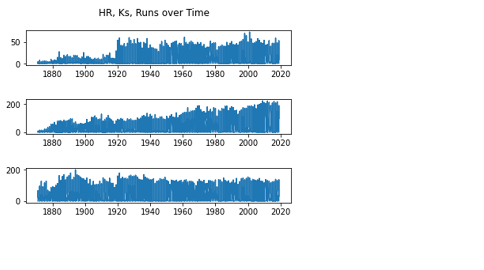
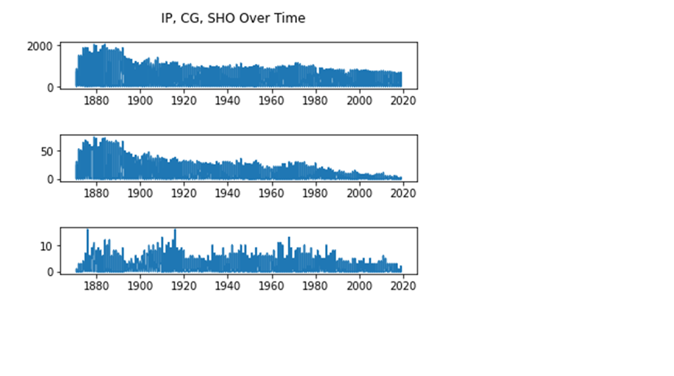

# Analyzing Historical MLB Trends

1. When I first downloaded Sean Lahman's historical baseball data I wasn't exactly sure what was looking for. So I created a way to search the data for interesting statistics. I printed out some lists and found that most of the records I searched either occurred before 1900, or in recent history. This led me toward analying how the game has changed since the 1800s and what that means for todays' game. 
2. I decided that the easiest way to move forward with my analyzation was to import pandas to work with the data. This was a unique challenge because I had never used Pandas before. I also imported matplotlib in order to make some plot later on which is something I wasnted to learn how to do.  
3. After playing with data.head() for a while to get familiar with indexing in pandas, I chose three statistics associated with hitting, and three with pitching, and used yearID as the common column. 
4. I wrote each of these shrunken versions of the original csv files into new csv's call hit_sub and pitch_sub in order to start plotting. 
5. After failing to create a histogram, I realized that I could make subplots that ould serve perfectly for presenting the time data for both pitching and hitting. 
6. Below are my subplots to display the change in hitting and pitching statistics. The order of these stats are correct in the title of each graph.
## Hitting

## Pitching
